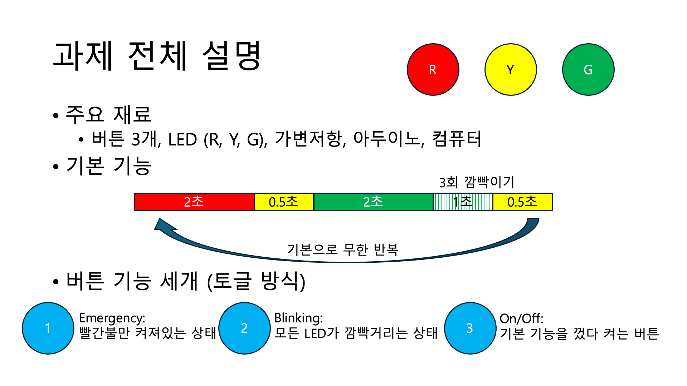

# 📌 임베디드통신시스템 과제1

## 📖 소개

[임베디드통신시스템]강의의 첫 과제로 Arduino와 p5.js를 이용하여 신호등을 제어하는 시스템을 만들어보았습니다. Arduino코드를 짤 때는 vs code에 platformIO를 설치하여 코드를 작성하였습니다.

## 과제 설명

## 동작 시연 영상

아래 사진을 클릭하면 동작이 시연되는 것을 확인해볼 수 있습니다.

---

## vs code에 platformIO를 설치하는 방법
vs code에서 platformIO가 설치되어있지 않았을 경우를 위해 설명을 간단히 적어보았습니다.  
1. vs code의 좌측에 5번째 항목에 해당하는 확장(extension)을 클릭
2. platformIO를 검색
3. 설치
4. 좌측에 개미모양 아이콘이 생기면 클릭
5. new project를 클릭
6. 프로젝트 이름을 원하는 이름으로 설정
7. 사용할 보드 선택 (저는 Arduino Uno를 사용했습니다.)

### 라이브러리에서 프로젝트에 추가
add project하여 추가하고 싶은 프로젝트를 선택
- TaskScheduler by Anatoli Arkhipenko
- PinChangeInterruptHandler by Andreas Rohner  

---
## 하드웨어
### 회로도
직접 연결한 회로도와 틴커캐드로 보기 쉽게 정리한 회로도 사진입니다.
- 직접 연결한 회로도

- 틴커캐드로 정리한 회로도 사진

| 연결된 부품 | 핀 번호 | 상태 |
|-----------|---------|------|
| 빨간색 LED | D6 | 🔴
| 노란색 LED | D3 | 🟡
| 초록색 LED | D5 | 🟢
| 버튼1 | D7 | 1️⃣
| 버튼2 | D8 | 2️⃣
| 버튼3 | D9 | 3️⃣
| 가변저항 | A0 | 🔆
| 전원 | 5V | 🔌
| 접지 | GND |  ⏚ 
---

## 소프트웨어

- 자세한 코드는 코드에 포함되어 있는 주석 참고

### Arduino

1️⃣ 아두이노 부팅 시 setup() 실행  
2️⃣ 각 버튼에 대해 인터럽트 설정 (attachPCINT)  
3️⃣ loop()에서 runner.execute() 실행 (TaskScheduler가 모든 동작 관리)  
4️⃣ 버튼을 누르면 모드가 변경되고, setMode()에서 해당 모드의 Task를 실행  
5️⃣ 가변저항을 통해 LED 밝기 조절 가능  
6️⃣ p5.js에서 시리얼 통신으로 신호등 시간 조정 가능  

### p5.js

아두이노와의 시리얼 통신을 통해 신호등 시스템을 웹 UI로 제어할 수 있도록 설계하였습니다.
사용자는 연결 버튼을 눌러 아두이노와 연결하고, 슬라이더를 이용해 신호등의 점등 시간과 밝기를 조절할 수 있습니다.
실제 신호등 상태는 UI에서 실시간으로 반영되며, 설정한 값은 아두이노에 전송됩니다.  
1️⃣ 시리얼 포트 연결 관리   
2️⃣ 신호등 상태 표시 (drawColorCircle())  
3️⃣ 슬라이더 및 버튼을 이용한 값 조정  
4️⃣ 모드 및 밝기 UI 업데이트 (drawIndicators(), drawBrightnessGauge())  
5️⃣ 화면 UI 요소 초기화 (setup())  

___
## 주의 & 참고 사항
- PWM이 지원되는핀으로 LED핀 번호를 설정해야 alalogWrite()를 지원합니다. 
    - PWM이 지원되는 핀 번호 : 3, 5, 6, 9, 10, 11

- loop()함수에서 delay()를 쓰게 되면 시간 지연이 발생할 수 있습니다.
    - loop()함수에서는 가급적 스케줄러만 동작하도록 하는 것이 좋습니다. 

- 라이브러리를 프로젝트에 미리 추가하여야 실행 가능합니다. 

- attachPCINT(digitalPinToPCINT(BUTTON1), buttonPressed1, FALLING); 명령어에서 FALLING은 하강엣지일 때를 의미합니다. 즉, 버튼을 누를 때 작동합니다. 
    - FALLING대신 CHANGE를 사용하면 버튼을 누르면 눌렀을 때와 땠을 때 모두 작동합니다. 
    - FALLING대신 RISING을 사용하면 버튼을 누르고 손가락이 때질 때 작동합니다. 

- TaskScheduler 사용하는 이유
    - delay() 없이 주기적인 작업을 쉽게 만들 수 있습니다.
    - 비동기 작업 처리 → delay() 없이 여러 작업을 동시에 실행 가능
    - CPU 효율적 사용 → 필요할 때만 실행되므로, loop()가 깔끔해짐
    - 우선순위 제어 → 특정 태스크의 실행 주기를 쉽게 조절 가능
    - 확장성 → 여러 개의 기능을 쉽게 추가 가능

- pinChangeInterrupt 사용하는 이유
    - 특정 핀의 상태가 변경될 때마다 자동으로 인터럽트를 발생시켜 처리하는 기능입니다.
    - 빠른 반응 속도 → loop()에서 digitalRead()로 버튼 상태를 계속 확인하는 것보다 훨씬 빠름
    - CPU 절약 → loop()에서 지속적으로 폴링(polling)하지 않아도 됨
    - 정확한 입력 감지 → 버튼, 센서 등의 빠른 신호 변화를 놓치지 않음

